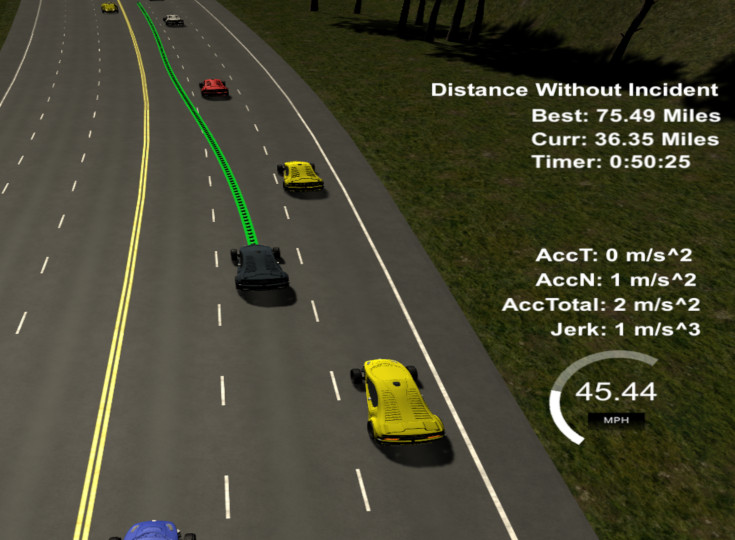
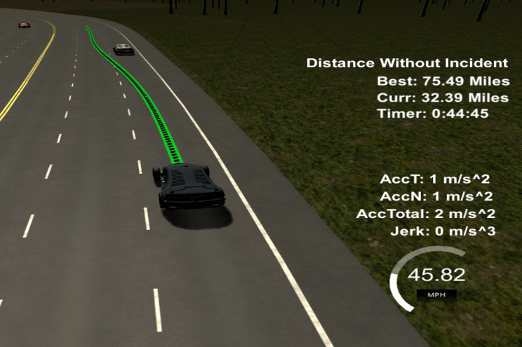
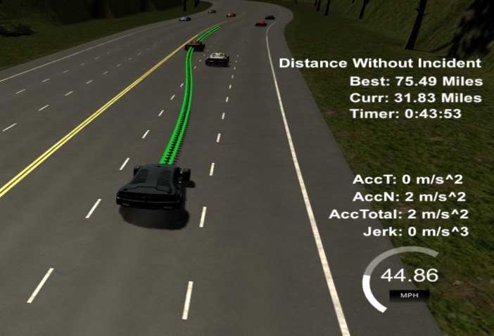

# Path Planning Project

In this project of the Udacity [Self-Driving Car NanoDegree](https://www.udacity.com/course/self-driving-car-engineer-nanodegree--nd013) program, I implement a path planning algorithm which will safely navigate a vehicle around a virtual highway with other traffic.

   
   
   

The Udacity [simulator tool](https://github.com/udacity/self-driving-car-sim/releases/tag/T3_v1.2) provides a virtual highway, a 6946m loop, with traffic that is driving +-10 MPH of the simulator's 50 MPH speed limit. Using the car's localization and sensor fusion data provided by the simulator, the path planner will generate and communicate a trajectory for the user's vehicle to the simulator. The trajectory enables the car to navigate close to the speed limit by changing lanes when slower traffic ahead gives reason to do so. The path planner will avoid collisions and react to other traffic changing speed or changing lanes. Our own vehicle will stay on center of one of the valid 3 lanes and avoid total acceleration over 10 m/s^2 and jerk that is greater than 10 m/s^3.

## Resources
* [Self-Driving Car NanoDegree](https://www.udacity.com/course/self-driving-car-engineer-nanodegree--nd013) course description at Udacity
* [Path Planning Project Starter Code](https://github.com/udacity/CarND-Path-Planning-Project) on GitHub

## Prerequisites
You can find detailed instructions for setting up your system on the starter code [project page](https://github.com/udacity/CarND-Kidnapped-Vehicle-Project). It involves installing a Unity-based [simulator tool](https://github.com/udacity/self-driving-car-sim/releases/tag/T3_v1.2) and a C++ webserver library [uWebSocketIO](https://github.com/uWebSockets/uWebSockets).

## Building and Running the Code
1. Clone this repository.
2. Make a build directory: `mkdir build && cd build`
3. Compile: `cmake .. && make`
4. Execute: `./path_planning`

## Structure
The original starter code was modified and extended to complete the project assignment:
* [planner.h](src/planner.h) / [planner.cpp](src/planner.cpp): Particle filter implementation (initialization, predication, weights, resampling)
* [helper_functions.h](src/helper_functions.h): Helper functions for creating jerk minimizing trajectories using quintic polynomial solving.
* [spline.h](src/spline.h): A header-only library for generating smooth trajectories using C-splines by [Tino Kluge](http://kluge.in-chemnitz.de/opensource/spline).

## Implementation Details

All essential logic of the path planner is contained in the class `Planner`. It is initialized once with the simulator speed limit (`Planner::setSpeedLimit`) and map data (`Planner::setMapData`).

Whenever the simulator tool provides updated localization information for the user vehicle (`Planner::updateCarLocalization`) and sensor fusion data for other traffic (`Planner::updateSensorFusion`), the planner will provide an updated path for controller of the simulator via `Planner::planTrajectory`.

This function will assemble and update a series of waypoints (in Frenet coordinates), each 2-3 seconds apart, using `Planner::suggestNextWaypoint`. Each waypoint consists of an *s*, *d* coordinate, their gradients and a time coordinate.

A new waypoint is chosen from the end of either of 3 possible trajectory prototypes:
1. Go straight (either at same speed or slowing down to avoid collision).
2. Change one lane to the left.
3. Change one lane to the right.

The trajectories are configured and evaluated depending on the following criteria:
* Velocity and distance of the next waypoint are chosen to stay below the maximum acceleration but close to the configured speed limit.
* Staying in the same lane is favored, unless:
  - The car is on any of the outer lanes (the inner lane provides more freedom to evade slower vehicles).
  - Slower traffic is ahead and a lange change would prevent us from slowing down.
  
Collision is avoided using `Planner::checkCollision`:
  - Traffic sensor fusion data is used to extrapolate speed and position of other vehicles around the time and position of the evaluated prototype trajectory end point.
  - A potential collision will discard trajectories for lane changes. If going straight remains the only option, the vehicle speed is adjusted to just under the traffic ahead, so that it can be followed at a safe distance (`Planner::m_distance_to_others`).

Using the logic above, a series of waypoints is established. On each run, waypoints are reevaluated, if they lie at least 0.5 s (`Planner::m_buffer`) in the future - this is important to avoid sudden jerk of the vehicle.

To allow smooth acceleration both in s- and d-direction (lane changes), a jerk-minimizing trajectory of intermediate points (again, in Frenet coordinates) is interpolated between these waypoints using `Planner::generateJerkMinimizingTrajectory`.

This creates a series of points in Frenet coordinates, each 0.2 seconds apart. These are used to setup C^1 Hermite splines in *x* and *y* Cartesian coordinates, from which the final x/y path point in 0.02 s distance are generated. C^1 Hermite splines have the benefit, that updates to the path have no global impact the the spline shape, if they are more than 2 segments away. 

For more details, please refer to the documented source code in [planner.h](src/planner.h) and [planner.cpp](src/planner.cpp).

## License
The contents of this repository are covered under the [MIT License](LICENSE).
